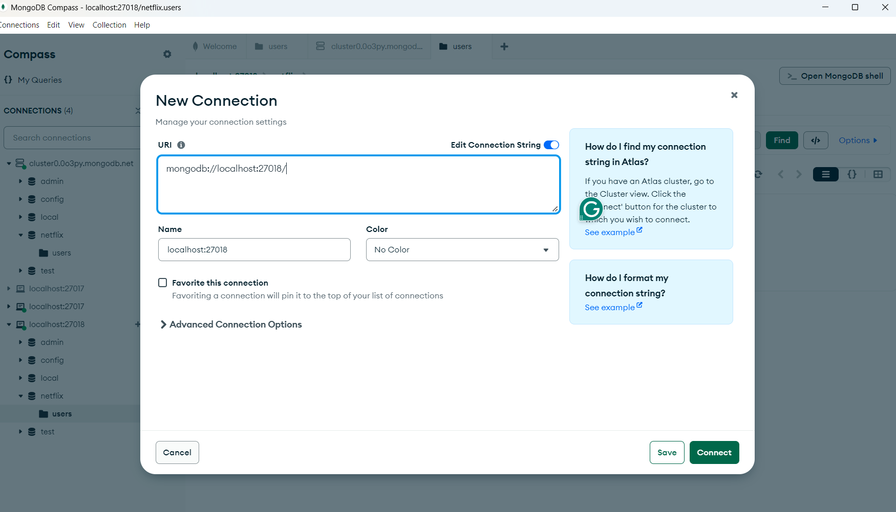
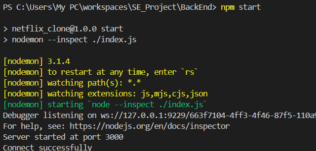
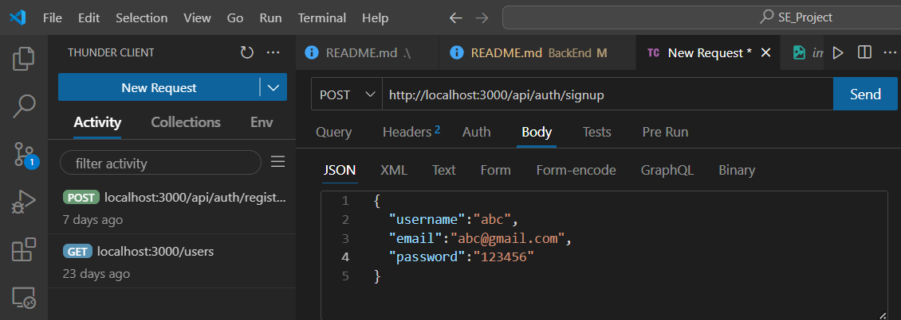
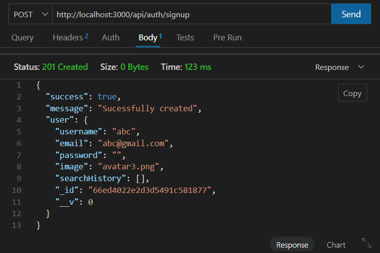

# Project Setup Guide
## <span style="color:red">Prerequisites</span>

Before you begin, ensure you have the following installed:
- [NodeJs](https://nodejs.org/en)
- [Docker](https://docs.docker.com/get-docker/)
- [MongoDB Compass](https://www.mongodb.com/try/download/compass)

## Step 1: Install Docker

1. **Download Docker**:
   - Go to the [Docker download page](https://docs.docker.com/get-docker/) and choose the installer for your operating system (Windows, macOS, or Linux).

2. **Install Docker**:
   - Follow the installation instructions specific to your operating system.

3. **Verify Installation**:
   - Open a terminal (or Command Prompt) and run the following command:
     ```bash
     docker --version
     ```
   - This should display the version of Docker installed.

## Step 2: Install MongoDB Compass

1. **Download MongoDB Compass**:
   - Visit the [MongoDB Compass download page](https://www.mongodb.com/try/download/compass) and choose the appropriate version for your operating system.

2. **Install MongoDB Compass**:
   - Follow the installation instructions for your operating system.

3. **Launch MongoDB Compass**:
   - Open MongoDB Compass after the installation is complete.

## Step 3: Set Up the Project with Docker


2. **Build and Start Docker Containers**:
   - Open Docker Desktop (to ensure the Docker Engine start properly)
   - Run the following command to start the services defined in the `docker-compose.yml` file:
     ```bash
     docker-compose up --build
     ```
   - This will start the backend application and MongoDB.

3. **Verify MongoDB is Running**:
   - Ensure that the MongoDB container is running by checking the logs:
     ```bash
     docker-compose logs mongo
     ```

## Step 4: Connect to MongoDB Using Compass

1. **Open MongoDB Compass**:
   - Launch the MongoDB Compass application.

2. **Create a New Connection**:
   - In the connection window, enter the following connection string:
     ```
     mongodb://localhost:27018/
     ```

   

3. **Connect**:
   - Click on the "Connect" button.

4. **Explore Your Database**:
   - Once connected, you should see the MongoDB databases. You can create a new database or explore existing ones.

## Additional Resources

- [Docker Documentation](https://docs.docker.com/)
- [MongoDB Compass Documentation](https://docs.mongodb.com/compass/current/)
## Step 5: Create a `.env` File

To configure environment variables for the backend, follow these steps:

1. **Navigate to the Backend Folder**:
   - Go to the `BackEnd` directory where your backend application is located.

2. **Create a `.env` File**:
   - Inside the `BackEnd` folder, create a file named `.env`.
   
3. **Add the Following Variables to the `.env` File**:
   ```plaintext
   MONGO_URI=mongodb://localhost:27018/netflix
   PORT=3000
   JWT_SECRET=YOUR_SECRET_KEY(Can be anything)
   MODE=development
   TMDB_API_KEY== YOUR_API_KEY
## Step 6: Start the Backend Server

After setting up the `.env` file and ensuring your Docker containers are running, you can start the backend server using npm. Follow these steps:


1. **Open a Terminal**:
   ```
   cd BackEnd
   npm install
   ```

2. **Run the Following Command**:
   ```bash
   npm start
3. **The result should be:**

   
# API Testing with Thunder Client

## Prerequisites
   - Run the following commands before getting started:
   ```
   cd BackEnd
   docker-compose up
   npm start
   ```

## Installing Thunder Client

1. Open Visual Studio Code (VS Code).
2. Go to the Extensions view by clicking on the Extensions icon in the Activity Bar on the side of the window or by pressing `Ctrl+Shift+X`.
3. In the search bar, type `Thunder Client` and press Enter.
4. Locate the Thunder Client extension and click the **Install** button.

## Testing the Sign-Up API

1. After installing Thunder Client, open it from the sidebar.
2. Click on the **New Request** button.
3. Set the request method to **POST**.
4. Enter the URL: `http://localhost:3000/api/auth/signup`.
5. Go to the **Body** tab and select **JSON**.
6. Enter the required JSON data for the sign-up. For example:
   ```json
   {
     "username": "testuser",

     "password": "yourpassword",
     "email":"youremail",
   }
   ```
   **Example**
   

7. It should return the messages
   
